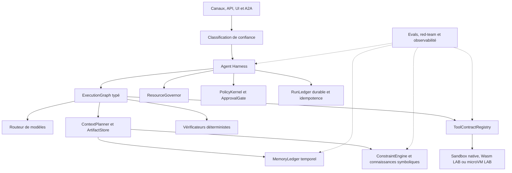

# Rapport de faisabilité et roadmap agentique 2026

> **Document de planification — 17 août 2026.** Ce rapport n'est pas une source de vérité sur les capacités disponibles. La disponibilité et la maturité publiques restent déterminées par `GET /api/v1/capabilities` et par [la procédure de certification](release/CAPABILITY_CERTIFICATION.md).

## 1. Objet et périmètre

Ce rapport consolide toutes les améliorations étudiées pendant la revue technologique de Promethe. Les dix listes reçues contenaient 58 formulations, dont une liste dupliquée et de nombreux recouvrements. Elles ont été ramenées à des programmes d'architecture cohérents, puis comparées au code actuel.

L'objectif n'est pas d'accumuler des technologies dites « SOTA », mais de répondre à quatre questions :

1. Qu'est-ce qui existe réellement dans Promethe ?
2. Qu'est-ce qui est faisable et utile maintenant ?
3. Qu'est-ce qui mérite une expérimentation isolée ?
4. Qu'est-ce qui doit être différé ou écarté ?

Les estimations de durée supposent une petite équipe de deux développeurs, avec une revue sécurité/QA ponctuelle. Elles indiquent un ordre de grandeur et non une date de livraison contractuelle.

## 2. Résumé exécutif

Promethe possède déjà des bases solides : boucle agentique, outils typés, approbation humaine obligatoire pour les effets externes, sandbox native, mémoire multi-fournisseur, profils et skills, orchestration multi-agent, checkpoints, A2UI, MCP, voix temps réel et tests de sécurité.

La priorité n'est toutefois pas d'ajouter du quantique, des essaims ou de l'auto-modification. La Phase 0 a posé les premières fondations du **harness de preuve** : evals-as-code, golden sets, identifiants de run/step et traces OpenTelemetry. Les déficits restants sont notamment :

- `agent_runs`, `tool_intents` et `agent_run_events` couvrent le cycle durable des runs, intentions, approbations et résultats ; il manque encore le chaînage cryptographique du journal ;
- les sorties textuelles volumineuses d'outils sont désormais conservées dans un `ArtifactStore` adressé par SHA-256 et récupérables par segments ; les captures, fichiers, pages, audio et traces ne sont pas encore externalisés ;
- les propositions de curation de skills ne disposent pas encore d'un workflow persistant de revue/promotion ;
- la synthèse multi-agent n'a pas encore de juge fondé sur des preuves ;
- `browser_vision` reste indisponible tant qu'aucun VLM n'analyse réellement la capture ;
- MCP doit suivre la spécification 2026 plutôt que développer `sampling` et `roots`, désormais dépréciés.

La stratégie recommandée est donc :

1. **Mesurer et certifier** : evals-as-code, traces réelles, métriques, jeux de régression.
2. **Durcir le runtime** : graphe d'exécution typé, journal durable, idempotence, budgets et artefacts.
3. **Sécuriser les capacités** : contrats d'outils et de skills, `PolicyKernel`, séparation des données non fiables, red-team automatique isolé.
4. **Améliorer le raisonnement** : mémoire temporelle, vérificateurs, moteur symbolique, calcul adaptatif et topologies limitées.
5. **Étendre l'interaction** : computer use hybride, A2UI gouverné, certification de la voix temps réel.

Les technologies matérielles et cryptographiques lourdes — PIM/CXL, SNN, quantique, zkML, interprétabilité mécanistique en production, hyperréseaux — ne sont pas justifiées pour Promethe à ce stade.

## 3. Méthode de classement

### 3.1 État du code

| État | Signification |
|---|---|
| `EXISTANT` | Une implémentation concrète est présente dans le dépôt. Elle n'est pas nécessairement certifiée `STABLE`. |
| `PARTIEL` | Une brique existe, mais il manque une propriété déterminante, une intégration ou une preuve. |
| `ABSENT` | Aucune implémentation significative n'a été trouvée. |

### 3.2 Décision

| Décision | Signification |
|---|---|
| `ADOPTER` | À intégrer à la trajectoire produit. |
| `EXPÉRIMENTER` | À tester derrière un flag `LAB`, avec budget et condition d'abandon. |
| `DIFFÉRER` | Potentiellement utile, mais sans besoin produit ou fondations suffisantes. |
| `ÉCARTER` | Mauvais rapport valeur/risque, promesse non fondée ou hors périmètre. |

### 3.3 Priorité

| Priorité | Interprétation |
|---|---|
| `P0` | Prérequis de preuve, sûreté ou intégrité. |
| `P1` | Forte valeur produit à court terme. |
| `P2` | À construire après les fondations P0/P1. |
| `P3` | Laboratoire ou besoin spécialisé. |
| `P4` | Hors roadmap active. |

Une technologie n'est promue que si elle possède un propriétaire, des métriques, des cas négatifs et des preuves reproductibles conformes à [CAPABILITY_CERTIFICATION.md](release/CAPABILITY_CERTIFICATION.md).

## 4. État actuel vérifié de Promethe

| Domaine | État vérifié | Diagnostic |
|---|---|---|
| Boucle agentique | `EXISTANT` | [`AIAgent.executeLoop`](../shared/src/commonMain/kotlin/dev/promethe/core/AIAgent.kt#L51) reste une boucle impérative limitée à dix itérations. Une migration progressive vers un graphe est possible ; une réécriture totale immédiate serait risquée. |
| Run ledger et reprise | `PARTIEL` | `AgentExecutionService` persiste l'identité, l'origine, la progression et l'état terminal dans `agent_runs`. `ActionExecutor` persiste chaque intention, son empreinte, sa clé d'idempotence et ses transitions terminales dans `tool_intents`, en refusant de rejouer une exécution à l'issue incertaine. `agent_run_events` conserve un journal append-only ordonné des runs, étapes, intentions, décisions d'approbation et outils sans contenu sensible. `RunRecoveryService` classe les exécutions interrompues en `RECOVERABLE` ou `NEEDS_REVIEW`, réclame atomiquement une reprise et poursuit la numérotation des étapes. Les sorties textuelles volumineuses sont reliées par hash à l'`ArtifactStore`. Le chaînage cryptographique du journal et la restauration automatique du contexte complet restent à faire. |
| Approbation et politique | `EXISTANT` | [`ActionExecutor`](../shared/src/commonMain/kotlin/dev/promethe/core/ActionExecutor.kt#L155) classe le risque et impose l'approbation obligatoire. [`ToolApprovalGate`](../shared/src/jvmMain/kotlin/dev/promethe/core/ToolApprovalGate.kt#L136) ne permet pas au mode `auto` de contourner `checkMandatory`. |
| Sandbox | `EXISTANT` | Sandbox native Rust, politique réseau et racines canoniques. WASI ou microVM seraient des backends supplémentaires, pas des remplacements immédiats. Voir [SANDBOX.md](SANDBOX.md). |
| Contexte | `PARTIEL` | [`ContextCompressor`](../shared/src/commonMain/kotlin/dev/promethe/core/ContextCompressor.kt#L42) compresse l'historique et [`ToolOutputPruner`](../shared/src/commonMain/kotlin/dev/promethe/core/ToolOutputPruner.kt#L34) réduit les sorties. [`ArtifactObservationExternalizer`](../shared/src/commonMain/kotlin/dev/promethe/core/ArtifactStore.kt) remplace les grandes sorties textuelles par un aperçu, un hash et une URI durable, lisibles par segments avec `artifact_read`. L'externalisation multimodale, les quotas, le chiffrement et le cycle de vie restent à ajouter. |
| Routage LLM | `PARTIEL` | [`MultiModelRouter`](../shared/src/commonMain/kotlin/dev/promethe/core/MultiModelRouter.kt#L26) route par profil/fournisseur et construit des fallbacks, mais ne choisit pas encore selon risque, coût, latence ou difficulté. |
| Budget autonome | `PARTIEL` | [`ResourceGovernor`](../shared/src/commonMain/kotlin/dev/promethe/core/ResourceGovernor.kt) réserve désormais les appels LLM, départs d'outil et sous-agents d'un même arbre de runs. Il bloque le départ suivant après dépassement de tokens, coût, durée ou compteurs. Son état reste en mémoire et les quotas durables par propriétaire, fournisseur et outil restent à ajouter. `AutonomousExecutor` conserve en parallèle son enveloppe de tâches historique. |
| Skills et GEPA | `PARTIEL` | Loader, writer, synthèse et évolution existent. [`SkillCurator`](../shared/src/commonMain/kotlin/dev/promethe/core/SkillCurator.kt) ne modifie plus les skills : il retourne des propositions en quarantaine. Il manque encore le workflow persistant de revue, les contrats et benchmarks de promotion. |
| Évaluation de trajectoire | `PARTIEL` | [`TrajectoryEvaluator`](../shared/src/commonMain/kotlin/dev/promethe/core/TrajectoryEvaluator.kt#L25) juge surtout le nombre d'outils, l'absence de chaîne `[ERROR]` et l'existence d'une réponse. Ce n'est pas une validation comportementale. |
| Multi-agent | `PARTIEL` | [`AgentOrchestrator`](../shared/src/jvmMain/kotlin/dev/promethe/core/AgentOrchestrator.kt#L19) gère délégation et concurrence. Le pseudo-mode `vote` a été retiré ; `best_of` et `merge` restent disponibles sans prétendre fournir un consensus vérifié. |
| Mémoire | `PARTIEL` | Mémoire L0-L3, namespaces, confiance et backends multiples. Pas de temps de validité, temps de transaction, supersession ou provenance complète. Voir [MEMORY.md](MEMORY.md). |
| Observabilité | `PARTIEL` | [`Tracing.jvm.kt`](../shared/src/jvmMain/kotlin/dev/promethe/core/Tracing.jvm.kt) utilise désormais OpenTelemetry avec export console, OTLP ou Langfuse, propagation coroutine et filtrage des contenus sensibles. Les métriques durables et SLO restent à compléter. |
| MCP | `PARTIEL` | Stdio, SSE et Streamable HTTP, découverte et proxy d'outils sont présents dans [`McpBridge`](../shared/src/commonMain/kotlin/dev/promethe/core/McpBridge.kt#L23). Il manque l'alignement complet sur MCP 2026-07-28. |
| Voix temps réel | `EXISTANT` | OpenAI Realtime et Gemini Live implémentent WebSocket, audio bidirectionnel, outils et interruption : [`OpenAIRealtimeRelay`](../gateway/src/jvmMain/kotlin/dev/promethe/gateway/voice/OpenAIRealtimeRelay.kt#L16), [`GeminiLiveRelay`](../gateway/src/jvmMain/kotlin/dev/promethe/gateway/voice/GeminiLiveRelay.kt#L20). Le besoin est la certification, pas une réécriture. |
| A2UI | `EXISTANT` | Registre de composants et état dynamique sont présents dans [`A2UIRegistry`](../composeApp/src/commonMain/kotlin/dev/promethe/app/a2ui/A2UIRegistry.kt#L12). Les composants générés doivent rester déclaratifs et whitelistés. |
| Computer use visuel | `PARTIEL` | Le navigateur sait utiliser des sélecteurs et prendre une capture. `browser_vision` n'est plus enregistré comme outil tant qu'aucune inférence visuelle n'est réellement exécutée. |
| Bus d'événements | `PARTIEL` | [`AgentEventBus`](../gateway/src/jvmMain/kotlin/dev/promethe/gateway/AgentEventBus.kt#L16) diffuse en mémoire vers les WebSockets, tandis que `agent_run_events` fournit l'historique durable des exécutions. Il manque encore la projection temps réel depuis ce journal et un runtime actor supervisé. |

## 5. Architecture cible

L'architecture cible conserve les composants utiles et ajoute un harness déterministe autour de l'inférence probabiliste.



### 5.1 Invariants de conception

- Un LLM peut **proposer** une action, jamais contourner une politique.
- Toute action avec effet possède une intention persistée, une clé d'idempotence et un résultat durable.
- Les données externes sont non fiables par défaut.
- Les données brutes volumineuses vivent dans un artefact adressé par hash, pas dans le contexte.
- Les changements de politique, de skill, de mémoire permanente ou de code sont proposés, testés, versionnés et approuvés.
- Un solveur garantit le respect du modèle encodé, pas la justesse de la traduction faite par le LLM.
- Une architecture multi-agent n'est utilisée que si les evals démontrent un gain supérieur à son coût.

## 6. Programmes de mise en œuvre

### Programme A — Evals et observabilité

**Décision : `ADOPTER`, P0.**

Livrables :

- `EvalCase`, `EvalSuite`, `EvalRun` et `EvalAssertion` versionnés ;
- jeux golden par capacité, skill, fournisseur et niveau de risque ;
- oracles déterministes : schéma, compilation, tests, diff, état final, politique ;
- traces OpenTelemetry réelles avec `runId`, `stepId`, modèle, tokens, coût, latence, cache, outil, risque et décision ;
- tableau de bord de taux de succès, coût par tâche, boucles, reprises et régressions ;
- `AdversarialEvalLab` isolé pour injections, faux résultats d'outils, MCP malveillant, exfiltration et contournement d'approbation.

Critères de sortie :

- 100 % des étapes d'un run ont un `runId` et un `stepId` ;
- chaque capacité P1 possède au moins un succès, un échec fournisseur et un cas sécurité négatif ;
- une régression connue bloque la CI ;
- aucune découverte red-team ne modifie automatiquement la production.

### Programme B — Harness, graphe et exécution durable

**Décision : `ADOPTER`, P0-P1.**

Introduire d'abord un graphe enveloppant la boucle existante :

```text
Receive → BuildContext → Plan/Respond → ValidateIntent
       → Approve → Execute → Verify → Persist → Continue/Finish
```

Livrables :

- `ExecutionGraph` et transitions scellées ;
- `RunLedger` append-only : `RunStarted`, `IntentProposed`, `ApprovalResolved`, `ToolStarted`, `ToolCompleted`, `VerificationCompleted`, `RunFinished` ;
- snapshots versionnés reconstruits depuis les événements ;
- idempotence persistante pour tout outil à effet ;
- pause/reprise sans thread actif ;
- fork d'une session logique sans prétendre restaurer automatiquement tout l'OS.

Critères de sortie :

- crash simulé avant, pendant et après un outil sans double effet ;
- replay déterministe des transitions non-LLM ;
- migration progressive sans casser l'API `AgentExecutionService` ;
- zéro boucle non bornée.

L'actor model intégral n'est pas requis. Des acteurs/coroutines isolés sont utiles pour les runs et sous-agents, tandis que le journal durable reste la source de vérité.

### Programme C — Gouverneur de ressources et routage adaptatif

**Décision : `ADOPTER`, P1.**

Créer un `ResourceGovernor` commun aux appels LLM, outils et sous-agents :

- réservation puis comptabilisation tokens/coût/temps/appels ;
- limites par run, session, utilisateur, fournisseur et outil ;
- détection de boucle, répétition et absence de progrès ;
- circuit breakers fournisseurs ;
- cascade SLM/rapide/frontier selon risque et complexité ;
- effort de raisonnement adaptatif ;
- escalade vers vérificateur ou comité seulement sur les tâches risquées.

Les « pulsions homéostatiques », enchères et cautions sont remplacées par des primitives mesurables : quotas, leases, priorités, backpressure et budgets.

### Programme D — ContextPlanner et ArtifactStore

**Décision : `ADOPTER`, P1.**

Livrables :

- prompt ordonné du plus stable au plus variable afin de favoriser le prefix caching ;
- `ArtifactStore` content-addressed pour sorties d'outils, captures, fichiers, pages, audio et traces ;
- observations compactes contenant faits extraits, provenance, hash et URI d'artefact ;
- pages de contexte sélectionnées par sous-tâche, avec contraintes épinglées non évictables ;
- mesure des tokens utiles, cache hits et erreurs causées par compression.

Ne pas implémenter un faux système de « RAM virtuelle » piloté librement par le LLM. Le paging doit rester déterministe, observable et récupérable.

### Programme E — ToolOps, SkillOps et MCP

**Décision : `ADOPTER`, P1.**

`ToolContract` doit déclarer :

- schémas d'entrée et de sortie ;
- effets `READ`, `WRITE`, `DESTRUCTIVE`, `EXTERNAL` ;
- idempotence et stratégie de retry ;
- permissions, domaines réseau et sensibilité des données ;
- timeout, budget et vérificateur de résultat ;
- compatibilité sandbox.

`SkillContract` doit ajouter :

- triggers et anti-triggers ;
- dépendances d'outils et de skills ;
- invariants, fixtures et eval suite ;
- provenance, version, propriétaire et maturité ;
- cycle `DRAFT → QUARANTINED → CANDIDATE → ACTIVE → DEPRECATED`.

Actions immédiates :

- remplacer les suppressions automatiques de `SkillCurator` par des propositions mises en quarantaine ;
- faire passer GEPA sur des jeux d'évaluation avant toute promotion ;
- charger les descriptions d'outils à la demande plutôt que synthétiser librement du code ;
- limiter le code-as-tools à une sandbox, un budget, des APIs autorisées et des artefacts éphémères ;
- viser MCP 2026-07-28 : HTTP stateless, MRTR, extension Tasks et JSON Schema 2020-12. Ne pas investir dans `roots` et `sampling`, dépréciés par SEP-2577.

### Programme F — PolicyKernel et défense contre les données non fiables

**Décision : `ADOPTER`, P0-P1.**

Livrables :

- noyau de politiques typées, versionnées et testables ;
- hiérarchie immuable entre politique système, organisation, projet et session ;
- séparation `UntrustedReader` sans outils à effet / `PrivilegedController` ;
- validation de provenance des sorties d'outils et ressources MCP ;
- contrôle d'egress, classification des données et redaction des secrets ;
- audit append-only avec chaîne de hash, sans le présenter comme une blockchain ;
- workflow d'amendement : proposition, analyse de conflit, evals, approbation, signature, canary, rollback.

Cette séparation réduit l'impact des injections indirectes, mais ne crée pas d'« immunité absolue ». Une constitution auto-modifiable par le modèle est explicitement interdite.

La vérification formelle est utile sur quelques invariants finis, par exemple :

```text
EXTERNAL_EFFECT ⇒ HumanApproved
DESTRUCTIVE ⇒ SandboxBounded ∧ HumanApproved
UntrustedReader ⇒ no effectful tools
BudgetExceeded ⇒ no new tool starts
```

Elle ne peut pas prouver la correction générale d'un LLM.

### Programme G — Mémoire temporelle et consolidation contrôlée

**Décision : `ADOPTER`, P2.**

Étendre le schéma de fait avec :

- `validFrom`, `validTo` : période de validité dans le monde ;
- `recordedAt`, `supersededAt` : histoire dans Promethe ;
- source, artefact, namespace, niveau de sensibilité et confiance ;
- relation `supersedes` au lieu d'une suppression silencieuse ;
- accès, renforcement et politique d'archivage.

La consolidation planifiée peut proposer fusion, contradiction, anonymisation et archivage. Par défaut elle ne supprime pas et ne fusionne pas les mémoires de plusieurs utilisateurs ou personas.

La mémoire fédérée/différentiellement privée n'a de sens qu'en présence d'un produit multi-tenant et d'un budget de confidentialité formel. Elle est différée.

### Programme H — Vérification, symbolique et causalité

**Décision : `ADOPTER` pour le symbolique ciblé ; `EXPÉRIMENTER` pour le causal, P2-P3.**

Construire un `ConstraintEngine` :

```text
Demande → IR typée → validation → SAT/SMT/ASP → témoin
        → explication → approbation → exécution
```

Cas adaptés : allocation, planning, permissions, conformité de configuration et règles métier. Le solveur garantit la solution par rapport au modèle encodé, pas la fidélité de la traduction LLM.

Les vérificateurs d'étape doivent préférer les oracles déterministes. Un PRM ou un juge LLM peut aider à router ou classer, jamais devenir la seule barrière d'une action critique.

Un `CausalIncidentLab` expérimental peut relier traces, dépendances, hypothèses et fault injection. Ses sorties sont des causes candidates avec incertitude. Il ne doit jamais annoncer une cause « certaine » à partir de simples logs observationnels.

### Programme I — Multi-agent adaptatif

**Décision : `ADOPTER` de façon limitée, P2.**

Corriger d'abord le vote actuel, puis sélectionner selon les evals entre quatre patrons :

1. agent unique ;
2. acteur + vérificateur ;
3. pipeline de spécialistes ;
4. exécution parallèle + juge indépendant.

Chaque délégation reçoit un budget, un contrat de résultat et un espace mémoire. La topologie est choisie parmi des templates testés ; aucun essaim P2P ou réseau librement auto-assemblé n'est autorisé en production.

Les scores de réputation peuvent informer le routage. Le staking, le slashing, la « majorité byzantine » entre copies corrélées d'un même modèle et les phéromones numériques ne garantissent ni vérité ni alignement.

### Programme J — Computer use et interfaces multimodales

**Décision : `ADOPTER`, P2.**

Pour le navigateur et l'OS :

```text
DOM/accessibilité → action sémantique → observation
          échec ↘ capture + grounding visuel ↗
                         ↓
               vérification post-action
```

Livrables :

- véritable passage de la capture à un modèle multimodal ;
- cibles visuelles ancrées avec coordonnées et score ;
- observation après chaque action ;
- détection d'absence de progrès et d'actions répétées ;
- approbation pour effets externes ou sensibles ;
- scénarios OSWorld-like reproductibles.

A2UI reste déclaratif, whitelisté et séparé de l'exécution de code. La voix full-duplex existante doit passer les tests de latence, interruption, coût, coupure fournisseur et sécurité des tool calls.

Un « tenseur synesthésique unique » est écarté. Promethe doit utiliser des événements multimodaux typés, synchronisés par temps et reliés à des artefacts avec provenance.

### Programme K — Isolation transactionnelle et self-healing supervisé

**Décision : `ADOPTER` le workflow supervisé ; `EXPÉRIMENTER` les nouveaux backends, P2-P3.**

Le self-healing acceptable suit ce cycle :

```text
Alerte → reproducer → sandbox → test rouge → patch minimal
       → tests et evals → PR signée → revue humaine
       → canary → promotion ou rollback
```

L'agent ne modifie ni son cœur en production, ni sa politique de sécurité, ni son classloader. Le hot-reload reste limité aux plugins versionnés et désactivables.

Backends optionnels :

- **WASI Component Model** : laboratoire après les contrats d'outils, pour modules compatibles et capacités explicites ;
- **microVM CoW** : seulement si le threat model exige une frontière VM et si les mesures démontrent un gain par rapport à la sandbox native ;
- **workspace transactionnel** : snapshots de fichiers, diff, commit/discard et rollback applicatif avant d'émuler une machine entière.

## 7. Roadmap d'implémentation

### Phase 0 — Baseline de preuve et corrections immédiates

**Durée indicative : 2 à 4 semaines. Priorité P0.**

| Chantier | Livrable | Critère de sortie |
|---|---|---|
| Evals | Modèles `EvalSuite`/`EvalRun`, premier golden set agent/outils/sécurité | Exécution locale et CI reproductible ; une régression bloque la PR |
| Observabilité | Backend OTLP ou OpenTelemetry compatible Kotlin 2.4 | Un run complet est visible avec coût, tokens, durée et outils |
| Skill safety | Curation en mode proposition/quarantaine | Aucun fichier de skill supprimé par une note LLM |
| Multi-agent | Remplacement du pseudo-vote | Le vote s'appuie sur critères/evidence ou est retiré |
| Browser vision | Capacité marquée indisponible ou réellement connectée à un VLM | Aucun succès fictif fondé sur la seule taille du base64 |
| Baseline sécurité | Corpus prompt injection, MCP poisoning, secrets, approval bypass | Résultats et ASR de référence archivés |

**Gate 0 :** aucune évolution cognitive automatique n'est autorisée tant que les evals et traces ne sont pas opérationnelles.

### Phase 1 — Runtime durable et économique

**Durée indicative : 6 à 8 semaines. Priorité P0-P1.**

1. **FAIT** — Étendre le premier `RunLedger` persistant avec les IDs d'intention et un journal append-only des transitions d'outil.
2. **FAIT** — Ajouter les clés d'idempotence et états d'outil persistants.
3. **FAIT** — Envelopper `executeLoop` dans le premier `ExecutionGraph`, classifier les runs interrompus et permettre leur reprise explicite sans thread actif.
4. **PARTIEL** — Créer `ResourceGovernor` global et propager le même budget aux sous-agents locaux. Les admissions atomiques couvrent les tentatives LLM, outils et sous-agents ; il reste à persister la consommation et à ajouter les quotas propriétaire, fournisseur et outil.
5. **PARTIEL** — Introduire `ArtifactStore` et observations référencées par hash. Les sorties textuelles d'outils sont adressées par SHA-256, reliées aux intentions et événements, et récupérables par segments. Il reste les artefacts binaires et multimodaux, le chiffrement, les quotas, la rétention et le garbage collection.
6. Stabiliser l'ordre du prompt et mesurer le prefix cache.

**Gate 1 :** trois scénarios de crash/reprise passent sans double effet ; un budget dépassé interdit tout nouveau départ d'outil.

### Phase 2 — Contrats, politiques et supply chain agentique

**Durée indicative : 6 à 10 semaines. Priorité P1.**

1. `ToolContractRegistry` et migration des outils sensibles.
2. `SkillContract`, états de maturité et suite d'evals par skill.
3. `PolicyKernel`, contrôle d'egress et audit hash-chained.
4. `UntrustedReader`/`PrivilegedController` pour web, e-mail et canaux.
5. `AdversarialEvalLab` planifié sur environnement isolé.
6. Mise à niveau MCP 2026-07-28 : stateless, MRTR, Tasks extension, schémas 2020-12.

**Gate 2 :** 100 % des outils avec effet possèdent contrat, approbation obligatoire et cas sécurité négatif ; aucun contenu non fiable brut ne peut directement déclencher un outil sensible.

### Phase 3 — Mémoire et raisonnement vérifiable

**Durée indicative : 8 à 12 semaines. Priorité P2.**

1. Migration bitemporelle et provenance de la mémoire.
2. Consolidation `proposal-only`, archivage et supersession.
3. `VerifierRegistry` pour schémas, tests, compilation et état final.
4. `ConstraintEngine` sur deux cas métier délimités.
5. Calcul adaptatif : effort, best-of-N et critique seulement selon risque.
6. `AdaptiveExecutionPlanner` limité aux quatre topologies approuvées.
7. Prototype `CausalIncidentLab` sur des pannes injectées.

**Gate 3 :** le moteur symbolique améliore les cas ciblés sans hausse du taux de faux succès ; les changements mémoire restent réversibles et attribuables.

### Phase 4 — Interaction avancée et isolation optionnelle

**Durée indicative : 8 à 12 semaines. Priorité P2-P3.**

1. Boucle computer use hybride avec vérification visuelle.
2. Certification A2UI déclarative et voix full-duplex.
3. Workspace transactionnel commit/discard.
4. Self-healing supervisé jusqu'à la PR et au canary.
5. PoC WASI sur un outil sans réseau et un outil réseau restreint.
6. PoC microVM seulement si la sandbox native ne satisfait pas le threat model.

**Gate 4 :** aucun contenu UI généré n'exécute de code arbitraire ; le computer use ne valide pas une action sans observation postérieure ; le self-healing ne déploie jamais sans approbation.

### Phase LAB — Recherche conditionnelle

Ces travaux n'entrent dans une version produit que sur besoin explicite et benchmark favorable :

- PRM spécialisé et RLVR hors ligne ;
- export DPO/KTO avec consentement et dé-identification ;
- WASI ou microVM à plus grande échelle ;
- TEE pour clients réglementés ;
- x402 pour marketplace A2A payante ;
- confidentialité différentielle pour apprentissage multi-tenant ;
- causalité avancée.

## 8. Dépendances et ordre obligatoire

| Avant de construire… | Il faut d'abord… |
|---|---|
| Graphes adaptatifs, PRM, test-time compute | Evals, traces et budgets |
| Durable execution, self-healing | Journal d'événements et idempotence |
| Code mode, JIT tools, WASI | `ToolContract`, sandbox et egress control |
| SkillOpt/GEPA autonome | Contrats de skills, golden sets et promotion contrôlée |
| Mémoire temporelle/consolidation | Provenance, namespaces et artefacts |
| VLA/computer use | PolicyKernel, observation post-action et approval |
| Neuro-symbolique | IR typée, validation et cas métier borné |
| Red-team continu | Environnement isolé, métriques et triage humain |
| Self-healing production | Reproducer, evals, PR, canary et rollback |

## 9. Matrice consolidée des 58 propositions

### 9.1 Runtime, orchestration et coût

| Proposition originale | État | Décision | Priorité | Forme retenue ou motif |
|---|---|---|---|---|
| Graph/Flow Engineering et Agent Harness | `PARTIEL` | `ADOPTER` | P1 | Graphe progressif autour de la boucle, transitions typées et PolicyKernel. |
| Speculative Tool Execution | `ABSENT` | `EXPÉRIMENTER` | P3 | Lecture seule, annulable, cacheable, après contrats et mesures de latence. |
| Durable Execution et time travel | `PARTIEL` | `ADOPTER` | P0-P1 | Ledger, idempotence, pause/reprise et fork logique ; pas rollback magique du monde externe. |
| SLM-first cascade | `PARTIEL` | `ADOPTER` | P1 | Routage selon difficulté, risque, coût et confidentialité. |
| Dual-system verifier/critic | `PARTIEL` | `ADOPTER` | P1-P2 | Oracle déterministe d'abord, juge LLM en complément. |
| Test-time compute/MCTS/Best-of-N | `PARTIEL` | `EXPÉRIMENTER` | P2-P3 | Sélectif et budgété ; MCTS seulement si benchmark utile. |
| Process Reward Model | `ABSENT` | `EXPÉRIMENTER` | P3 | Score par étape comme signal, jamais barrière unique. |
| Actor model et event-sourced runtime | `PARTIEL` | `ADOPTER` reformulé | P0-P2 | `RunLedger` durable et isolation par run/sous-agent ; pas de réécriture « zero-lock ». |
| Dynamic topology morphing | `PARTIEL` | `EXPÉRIMENTER` | P2 | Sélection parmi quatre templates évalués. |
| Cognitive allostasis | `PARTIEL` | `ADOPTER` reformulé | P1 | `ResourceGovernor`, pas de métaphore biologique ni purge brutale. |

### 9.2 Contexte et mémoire

| Proposition originale | État | Décision | Priorité | Forme retenue ou motif |
|---|---|---|---|---|
| Prefix-cache alignment | `PARTIEL` | `ADOPTER` | P1 | Prompt stable → semi-stable → dynamique, avec mesure réelle des gains. |
| Tool output compaction/masking | `PARTIEL` | `ADOPTER` | P1 | Résumé + hash + artefact récupérable. |
| Context virtualization/demand paging | `PARTIEL` | `ADOPTER` reformulé | P1-P2 | `ContextPlanner` déterministe et contraintes épinglées. |
| Temporal Knowledge Graph | `PARTIEL` | `ADOPTER` | P2 | Mémoire bitemporelle et relations de supersession avant un graphe complet. |
| Nocturnal consolidation | `PARTIEL` | `EXPÉRIMENTER` | P2 | Propositions réversibles, jamais suppression autonome. |
| Ebbinghaus decay/garbage collection | `ABSENT` | `EXPÉRIMENTER` | P2-P3 | Archivage par utilité et politique, pas oubli irréversible par ancienneté. |
| Hardware KV-cache streaming/attention sinks | `ABSENT` | `ÉCARTER` | P4 | Relève du serveur d'inférence/modèle, pas du cœur Promethe. |
| Federated/differential-private memory | `ABSENT` | `DIFFÉRER` | P3-P4 | Seulement avec vrai apprentissage multi-tenant et budget DP. |
| Cross-modal synesthetic state space | `ABSENT` | `ÉCARTER` | P4 | Remplacer par événements typés, timestamps et artefacts multimodaux. |

### 9.3 Outils, skills, connaissances et protocoles

| Proposition originale | État | Décision | Priorité | Forme retenue ou motif |
|---|---|---|---|---|
| SkillOps et contrats | `PARTIEL` | `ADOPTER` | P1 | Contrats, dépendances, evals, provenance et promotion. |
| Dynamic tool synthesis/code mode | `PARTIEL` | `EXPÉRIMENTER` | P2-P3 | Orchestration de capacités autorisées en sandbox ; pas enregistrement automatique permanent. |
| Next-gen MCP sampling/roots | `ABSENT` | `ÉCARTER` sous cette forme | P0 | Cibles dépréciées ; adopter MRTR, Tasks et stateless MCP 2026-07-28. |
| Symbolic knowledge compiler | `ABSENT` | `ADOPTER` ciblé | P2 | Compiler uniquement les règles autoritatives et versionnées. |
| Neuro-symbolic ASP/SMT | `ABSENT` | `ADOPTER` ciblé | P2 | IR typée, preuve/témoin et validation de traduction. |

### 9.4 Sécurité, identité et gouvernance

| Proposition originale | État | Décision | Priorité | Forme retenue ou motif |
|---|---|---|---|---|
| Cryptographic action provenance | `PARTIEL` | `ADOPTER` | P1 | Journal append-only hash-chained et signatures sur artefacts critiques. |
| Dual-LLM privilege separation | `PARTIEL` | `ADOPTER` | P1 | Lecteur non privilégié + contrôleur, sans promesse d'immunité. |
| CoW microVM snapshots | `ABSENT` | `EXPÉRIMENTER` | P3 | Seulement sur threat model et benchmark favorables. |
| DID/verifiable credentials | `ABSENT` | `DIFFÉRER` | P3-P4 | OAuth/mTLS/signatures suffisent tant qu'il n'existe pas de fédération ouverte. |
| Mental sandbox/world simulation | `PARTIEL` | `ADOPTER` reformulé | P2 | Workspace transactionnel et exécution réelle isolée, pas world model omniscient. |
| WASI Component sandbox | `ABSENT` | `EXPÉRIMENTER` | P3 | Backend pour outils compatibles après `ToolContract`. |
| Conformal uncertainty gating | `ABSENT` | `EXPÉRIMENTER` | P3 | Seulement avec jeux échangeables et calibration empirique ; aucune garantie universelle. |
| Representation engineering/activation steering | `ABSENT` | `ÉCARTER` | P4 | Nécessite accès aux activations et ne remplace pas un contrôle déterministe. |
| Formal verification TLA+/Z3/LTL | `ABSENT` | `ADOPTER` ciblé | P2 | Prouver quelques invariants finis du graphe et des politiques. |
| Confidential computing/TEE | `ABSENT` | `DIFFÉRER` | P4 | Besoin de déploiement cloud réglementé et d'attestation opérationnelle. |
| Mechanistic interpretability/SAE live | `ABSENT` | `ÉCARTER` | P4 | Recherche modèle, pas contrôle d'application fiable. |
| Zero-knowledge compliance/zkML | `ABSENT` | `DIFFÉRER` | P4 | Coût et complexité non justifiés ; commencer par audit et minimisation. |
| Continuous generative red-teaming | `ABSENT` | `ADOPTER` | P1 | Exécution isolée, cas de régression et correctifs proposés/revus. |
| Dynamic constitutional AI | `ABSENT` | `ADOPTER` reformulé | P1-P2 | Constitution immuable, amendements proposés puis approuvés. |
| Side-channel/steganographic defense | `ABSENT` | `DIFFÉRER` | P3 | Prioriser allowlists egress, DLP, quotas et réduction des secrets exposés. |

### 9.5 Apprentissage et auto-évolution

| Proposition originale | État | Décision | Priorité | Forme retenue ou motif |
|---|---|---|---|---|
| Continuous evals-as-code | `PARTIEL` | `ADOPTER` | P0 | Fondement de toutes les promotions de prompt, skill, modèle et politique. |
| Trajectory self-distillation/DPO | `PARTIEL` | `EXPÉRIMENTER` | P3 | Export consenti, filtré et dé-identifié ; entraînement hors ligne. |
| RL from verifiable rewards | `PARTIEL` | `EXPÉRIMENTER` | P3 | Oracles réutilisables immédiatement ; entraînement seulement si volume suffisant. |
| Autonomous self-healing/auto-PR | `PARTIEL` | `ADOPTER` supervisé | P2 | Jusqu'à PR, canary et rollback ; jamais déploiement libre. |
| Recursive self-refactoring/hot-swap | `PARTIEL` | `ÉCARTER` sous cette forme | P4 | Remplacé par self-healing supervisé et plugins versionnés. |
| Genetic persona cross-breeding | `PARTIEL` | `ÉCARTER` sous cette forme | P4 | Composer profils, skills et mémoires isolées ; ne pas fusionner les mémoires. |
| Hypernetworks/dynamic LoRA | `ABSENT` | `ÉCARTER` | P4 | Recherche de modèle sans justification produit. |

### 9.6 Multi-agent, économie et réseau

| Proposition originale | État | Décision | Priorité | Forme retenue ou motif |
|---|---|---|---|---|
| Multi-agent deliberation/consensus | `PARTIEL` | `EXPÉRIMENTER` | P2 | Vérificateurs diversifiés et juge ; pas « Byzantine-resistant » par défaut. |
| x402 agent payments | `ABSENT` | `DIFFÉRER` | P4 | Seulement si Promethe devient une marketplace payante d'agents. |
| P2P gossip/knowledge mesh | `ABSENT` | `DIFFÉRER` | P4 | Complexité, cohérence et supply-chain risk sans besoin actuel. |
| Stigmergic swarms | `ABSENT` | `ÉCARTER` | P4 | Les marqueurs partagés ne donnent ni O(1) global ni coordination fiable. |
| Mechanism design/staking/slashing | `ABSENT` | `ÉCARTER` | P4 | Remplacer par quotas, budgets, leases, SLA et scores évalués. |

### 9.7 Interfaces et matériel

| Proposition originale | État | Décision | Priorité | Forme retenue ou motif |
|---|---|---|---|---|
| Full-duplex WebRTC/speech-to-speech | `EXISTANT` | `ADOPTER`/certifier | P1-P2 | WebSocket full-duplex déjà présent ; tester latence, barge-in, outils et résilience. |
| GenUI/Wasm artifacts | `EXISTANT` partiel | `ADOPTER` reformulé | P2 | A2UI déclaratif et whitelisté, pas micro-app arbitraire compilée à la volée. |
| VLA/pixel grounding | `PARTIEL` | `ADOPTER` hybride | P2 | Sémantique d'abord, vision en fallback, validation post-action. |
| PIM/CXL acceleration | `ABSENT` | `ÉCARTER` | P4 | CXL est un interconnect cohérent ; aucune charge Promethe ne justifie du PIM. |
| Neuromorphic SNN wake loops | `ABSENT` | `ÉCARTER` | P4 | Webhooks et event loops suffisent ; éventuellement firmware spécialisé hors Promethe. |
| Quantum-classical planning | `ABSENT` | `ÉCARTER` | P4 | Utiliser CP-SAT/MILP/SMT ; aucun optimum instantané garanti par QAOA/annealing. |

### 9.8 Raisonnement causal

| Proposition originale | État | Décision | Priorité | Forme retenue ou motif |
|---|---|---|---|---|
| Causal/counterfactual reasoning | `ABSENT` | `EXPÉRIMENTER` | P3 | Graphe causal déclaré, interventions sandboxées et incertitude explicite. |

## 10. Éléments explicitement non faisables ou non souhaitables

Dans leur formulation originale, les promesses suivantes doivent être rejetées :

- « zéro hallucination » grâce à ASP/SMT ;
- « immunité architecturale absolue » aux injections par dual-LLM ;
- retour arrière automatique de tout effet externe grâce à un checkpoint ;
- contexte infini sans dégradation grâce aux attention sinks ;
- cause racine certaine déduite de logs observationnels ;
- alignement mathématique garanti par staking/VCG ;
- consensus byzantin obtenu avec trois personas LLM ;
- self-refactoring et hot-swap libre du cœur en production ;
- fusion héréditaire des mémoires de personas ;
- constitution de sécurité auto-amendée par l'agent ;
- détection fiable de « circuits de tromperie » avant le premier token ;
- exécution Wasm « mathématiquement impossible à évader » ;
- traversée PIM/CXL en microsecondes comme propriété de l'application ;
- ordonnancement quantique optimal instantané d'un problème NP-difficile.

Ces formulations confondent souvent preuve locale, hypothèses du modèle, résultats de benchmark et garantie système.

## 11. Indicateurs de pilotage

| Dimension | Indicateurs |
|---|---|
| Qualité | Taux de réussite golden, exactitude par skill, faux succès du vérificateur, satisfaction humaine |
| Fiabilité | Reprises réussies, doubles effets, taux de boucle, erreurs par outil, rollback/canary |
| Sécurité | Attack success rate, contournements d'approbation, exfiltrations, outils non contractés, secrets exposés |
| Coût | Coût par tâche réussie, tokens utiles, appels spéculatifs jetés, coût des comités multi-agents |
| Latence | p50/p95 total, TTFT, temps outil, temps d'approbation, temps de reprise |
| Contexte | Taille moyenne, ratio artefact/résumé, cache hit, erreurs attribuées à la compression |
| Mémoire | Faits sourcés, contradictions ouvertes, supersessions, restaurations après consolidation |
| Gouvernance | Promotions avec preuves, changements non approuvés, âge des revues, capacités déclassées |

Conditions d'abandon d'une expérimentation : gain inférieur à 5 % sur la qualité à coût égal, coût supérieur à 2× sans gain de sûreté mesurable, hausse des faux succès, impossibilité de reproduire les résultats ou absence de propriétaire.

## 12. Registre des décisions prioritaires

| ID | Décision | Priorité |
|---|---|---|
| ADR-F01 | Les evals et traces précèdent toute auto-évolution | P0 |
| ADR-F02 | Le runtime devient durable par événements et idempotence, pas par snapshot seul | P0 |
| ADR-F03 | Les outils avec effet restent derrière politique et approbation obligatoires | P0 |
| ADR-F04 | Les skills sont mis en quarantaine et promus par preuve ; aucune suppression LLM directe | P0 |
| ADR-F05 | Le contexte brut volumineux est externalisé dans un `ArtifactStore` | P1 |
| ADR-F06 | MCP cible la spécification 2026-07-28 ; `roots` et `sampling` ne sont pas de nouvelles cibles | P0 |
| ADR-F07 | La mémoire devient bitemporelle et réversible avant toute consolidation automatique | P2 |
| ADR-F08 | Le symbolique est limité à des domaines formalisés avec validation de traduction | P2 |
| ADR-F09 | Le multi-agent utilise des templates évalués, pas des essaims libres | P2 |
| ADR-F10 | L'auto-réparation s'arrête à la PR/canary sous contrôle humain | P2 |
| ADR-F11 | L'UI générée reste déclarative ; le computer use est hybride et vérifié | P2 |
| ADR-F12 | Les axes matériels/quantique restent hors roadmap active | P4 |

## 13. Références

### Documentation interne

- [Architecture](ARCHITECTURE.md)
- [Agents et orchestration](AGENTS.md)
- [Sécurité](SECURITY.md)
- [Sandbox](SANDBOX.md)
- [Résilience et contexte](RESILIENCE.md)
- [Mémoire](MEMORY.md)
- [Observabilité](OBSERVABILITY.md)
- [GEPA](GEPA.md)
- [MCP](MCP.md)
- [A2UI](A2UI.md)
- [Plugins](PLUGINS.md)

### Sources externes primaires ou techniques

- [MCP 2026-07-28 : MRTR, Tasks, stateless et dépréciations](https://blog.modelcontextprotocol.io/posts/2026-07-28/)
- [SEP-2577 : dépréciation de Roots, Sampling et Logging](https://modelcontextprotocol.io/seps/2577-deprecate-roots-sampling-and-logging)
- [GPT-Red : red-teaming automatique par self-play](https://arxiv.org/abs/2607.26115)
- [AutoMalTool : red-team des outils MCP](https://arxiv.org/abs/2509.21011)
- [OSWorld : benchmark d'agents multimodaux sur ordinateur](https://arxiv.org/abs/2404.07972)
- [LLM+ASP : raisonnement non monotone et autocorrection](https://arxiv.org/abs/2604.27960)
- [Limites des contrefactuels sous incertitude](https://arxiv.org/abs/2503.23820)
- [AMAS : topologies multi-agents adaptatives](https://arxiv.org/abs/2510.01617)
- [Constitution de Claude 2026](https://www.anthropic.com/news/claude-new-constitution)
- [CXL : interconnect cohérent pour mémoire et accélérateurs](https://computeexpresslink.org/about-cxl/)
- [Loihi 2 : plateforme neuromorphique](https://www.intel.com/content/dam/www/central-libraries/us/en/documents/neuromorphic-computing-loihi-2-brief.pdf)
- [Limites comparées du recuit quantique en optimisation](https://www.nature.com/articles/s41598-025-96220-2)
- [x402 : protocole de paiement HTTP](https://docs.x402.org/introduction)

## 14. Conclusion

La trajectoire réaliste vers un Promethe de haut niveau ne passe pas par 58 composants indépendants. Elle passe par un petit nombre de fondations composables : preuves, journal durable, politiques, contrats, budgets, artefacts, mémoire temporelle et vérification.

Une fois ces fondations certifiées, Promethe pourra expérimenter sans danger le raisonnement adaptatif, le neuro-symbolique, la causalité, WASI et le computer use avancé. Sans elles, les capacités dites « frontier » augmenteraient surtout la surface d'attaque, le coût et l'imprévisibilité.
