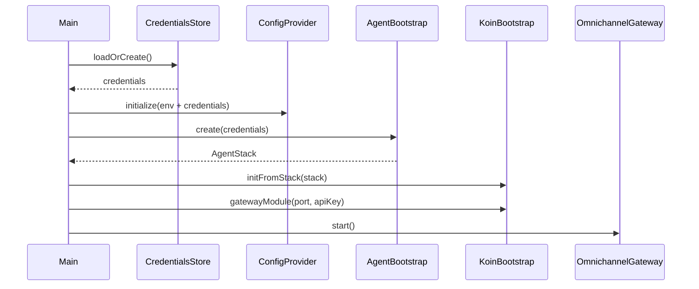
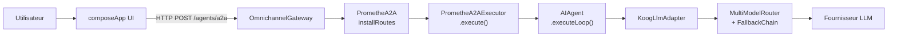

# Prométhé Architecture — Phase B

## 1. Overview

Prométhé is an autonomous AI agent built with **Kotlin Multiplatform** (KMP).
The project is split into four Gradle modules: a shared core (`:shared`), an HTTP/WebSocket server (`:gateway`), API models (`:api`), and a Compose Multiplatform interface (`:composeApp`).
The agent supports several launch modes (GUI, CLI, daemon), communicates with LLMs via a multi-model router with fallback, and exposes a bus of 19 messaging channels.

---

## 2. Gradle Modules

| Module | Role | Key technologies |
|---|---|---|
| `:shared` | Common KMP code — agent core, tools, memory, LLM adapter, persistence | Kotlin/JVM, Exposed, Flyway, Koin |
| `:gateway` | HTTP/WS server — omnichannel routing | Ktor 3.5.0 CIO |
| `:api` | Data models and API interfaces | Kotlin (shared structures) |
| `:composeApp` | Compose Multiplatform UI + unified entry point | Desktop / Wasm / Android / iOS |

---

## 3. Launch Modes

| Command | Mode | Description |
|---|---|---|
| `promethe` | Desktop GUI | Graphical interface + embedded gateway |
| `promethe --cli` | Embedded CLI | Gateway + REPL in the same process |
| `promethe --connect <url>` | CLI client | Connects to a remote gateway |
| `promethe --daemon` | Headless server | Gateway only, no UI |

---

## 4. Bootstrap Sequence

1. `CredentialsStore.loadOrCreate()` — loads or creates credentials
2. `ConfigProvider.initialize()` — merges env + credentials
3. `AgentBootstrap.create(credentials)` → returns an `AgentStack` containing:
   - **AgentConfig**, **Database** (SQLite via Exposed + Flyway), **HttpClient**
   - **KoogLlmAdapter** → MultiModelRouter → FallbackChain
   - **ToolRegistry** — `file_read`, `file_write`, `http_fetch`, `git`, `patch`, `memory`, `skill`, `delegation`, `introspection`
   - **HookManager** — LoggingHook, MetricsHook, GuardrailHook, WebhookDispatchHook, GepaFeedbackHook
   - **MemoryLayer** → MemoryProvider (Embedded / Honcho / Tencent + FallbackMemoryProvider)
   - **SkillLoader** + SkillWriter + SkillCurator
   - **AgentOrchestrator** (multi-agent delegation)
   - **AgentA2ABootstrap** → AgentA2ARegistry
   - **McpBridge** → JvmMcpTransportFactory (Stdio + SSE)
   - **TaskScheduler**, **GepaScheduler**
   - **ActionExecutor** → AutoHealingExecutor
   - **PluginLoader** + HotReloadWatcher
   - **ToolApprovalGate** (optional)
4. `KoinBootstrap.initFromStack(stack)` — DI wiring
5. `gatewayModule(port, apiKey, ...)` — registration of gateway dependencies in Koin
6. `OmnichannelGateway.start()` — starts the HTTP server

---

## 5. Request Flow

---

## 6. Dependency Injection (Koin)

| Step | Scope | Registered components |
|---|---|---|
| `KoinBootstrap.initFromStack(stack)` | `:shared` | AgentConfig, Database, HttpClient, KoogLlmAdapter, ToolRegistry, HookManager, MemoryLayer, SkillLoader, AgentOrchestrator, McpBridge, TaskScheduler, ActionExecutor, PluginLoader… |
| `gatewayModule()` | `:gateway` | OmnichannelGateway, HTTP server–specific dependencies |

---

## 7. Persistence

- **Engine**: SQLite via Exposed 1.3.0 + Flyway 12.8.1 migrations

| Table | Role |
|---|---|
| Sessions | Conversation sessions |
| Messages | Messages (FTS5 indexing) |
| Feedbacks | User feedback |
| AgentProfiles | Agent profiles |
| Checkpoints | Agent checkpoints |
| UserFacts | User memory facts |
| ScheduledTasks | Scheduled tasks |
| Webhooks | Outbound webhooks |
| McpServers | Configured MCP servers |

---

## 8. Messaging Channels (19)

**13 dedicated files:**
Telegram · Discord · Slack · WhatsApp · Signal · Matrix · Email · SMS · Teams · Mattermost · DingTalk · Feishu · WeCom

**6 in `ExtraChannels.kt`:**
LINE · QQ · Weixin · BlueBubbles · Ntfy · Home Assistant

---

## 9. Hook System

`HookManager` (registered during `AgentBootstrap.create()`) fires lifecycle events
(`BEFORE_TOOL_CALL`, `AFTER_TOOL_CALL`, `ON_ERROR`, `SESSION_START`, `SESSION_END`) through an
ordered chain of `Hook`s; any hook can `Abort` or `Modify` the flow. Built-in hooks registered at
bootstrap: `LoggingHook` (audit trail), `MetricsHook` (tool-call/error counters), `GuardrailHook`
(blocks dangerous tools/args per the configured `GUARDRAIL_PRESET`, e.g. `dev-safe`),
`WebhookDispatchHook` (optional, only if `PROMETHE_WEBHOOK_URL` is set), and `GepaFeedbackHook`
(feeds trajectory outcomes into the GEPA scheduler). See **OBSERVABILITY.md** for metrics/logging
detail and **SECURITY.md** for the guardrail/approval-gate model — `GuardrailHook` is part of the
secure-by-default posture and should not be loosened without an explicit ask.

## 10. MCP Bridge

Prométhé both **consumes** and **exposes** MCP tools. As a **client**, `McpBridge` (wired in
`AgentBootstrap.create()` with `JvmMcpTransportFactory`) connects to external MCP servers declared
through `MCP_SERVERS` or encrypted SQLite (`McpConfigLoader.loadConfigs()`), auto-connects on startup, and registers
their tools into `ToolRegistry`. As a **server**, the gateway exposes Prométhé's own `ToolRegistry`
over MCP (HTTP and `--mcp-stdio`), so external MCP clients (IDEs, other agents) can call Prométhé's
tools. See **MCP.md** for the full client/server component breakdown and transports (stdio, SSE,
streamable HTTP).

## 11. RAG / Knowledge Base

Enabled conditionally via `RAG_ENABLED=true` (`IntegrationRegistrar`, jvmMain): when set, an
embedding service and vector store are built from `RAG_EMBEDDING_*` / `RAG_VECTOR_*` config, wired
into a `KnowledgeBase`, and three tools are registered — `knowledge_search`, `knowledge_ingest`,
`knowledge_delete`. When disabled (default), none of this is loaded and no RAG tools appear in the
registry. See **RAG.md** for embedding providers, vector stores, and the ingestion/search pipeline.

## 12. Main Routes

| Route | Protocol | Description |
|---|---|---|
| `/.well-known/agent.json` | GET | A2A Agent Card (dynamic) |
| `/.well-known/acp.json` | GET | ACP Agent Card |
| `/agents/` | POST | A2A JSON-RPC (`message/send`, `message/stream`, `tasks/get`) |
| `/mcp` | — | MCP server routes |
| `/api/v1/sessions` | REST | Session CRUD |
| `/api/v1/agents` | REST | Agent profile CRUD |
| `/api/v1/memory/...` | REST | Memory facts |
| `/api/v1/feedback/...` | REST | Feedback |
| `/api/v1/scheduler/...` | REST | Task scheduler |
| `/api/v1/channels` | REST | Channel management |
| `/api/v1/config/env` | REST | Env configuration |
| `/api/v1/mcp/...` | REST | MCP server management |
| `/api/v1/skills/...` | REST | Skill CRUD |
| `/api/v1/orchestrator/...` | REST | Multi-agent orchestration |
| `/api/v1/goal` | REST | Autonomous goals |
| `/api/v1/status` | GET | Dashboard status |
| `/api/v1/rag/...` | REST | RAG knowledge base |
| `/api/v1/plugins/...` | REST | Plugin management |
| `/api/v1/voice/...` | REST | Voice + TTS configuration |
| `/api/v1/webhooks/...` | REST | Webhook management |
| `/approval/...` | REST | Tool approval gate |
| `/ws/agents` | WebSocket | Monitor events |
| `/ws/chat/voice` | WebSocket | Real-time voice stream |
| `openAiCompatRoutes` | REST | OpenAI-compatible API |
